# 🏥 Hospital Management System (HMS)

A full-stack medical portal built with **Node.js, Express, and MongoDB Atlas**.


---

## 🌟 Key Features

- **Triple-Role Access** — Dedicated dashboards for Doctors, Receptionists and Patients, each with its own navigation and server-side permission checks.
- **Smart Record Linking** — Patients see their history based on their login email. A receptionist can file a walk-in visit *before* the patient ever registers; the moment that person signs up with the same email, the entire history appears in their portal.
- **Appointment Management** — Real-time scheduling with one-click "Complete" status toggles, plus double-booking protection on every slot.
- **Prescription System** — Doctors issue digital prescriptions with unlimited medicine rows (dosage / frequency / duration), advice and follow-up dates. Prescriptions drop straight into the patient's file and are print-ready.

---

## 🛠️ Tech Stack

| Layer        | Technology                                        |
|--------------|---------------------------------------------------|
| **Backend**  | Node.js, Express                                  |
| **Database** | MongoDB Atlas (Mongoose ODM)                      |
| **UI**       | EJS, Bootstrap 5, FontAwesome 6                   |
| **Auth**     | Session-based (`express-session`) + Bcrypt hashing |
| **Sessions** | `connect-mongo` — persisted in MongoDB            |

---

## 🚀 Getting Started

### 1. Install dependencies
```bash
npm install
```

### 2. Configure the database
Copy the example env file and paste your MongoDB Atlas connection string:
```bash
cp .env.example .env
```

Then edit `.env`:
```env
MONGO_URI=mongodb+srv://<user>:<pass>@cluster0.xxxxx.mongodb.net/hms?retryWrites=true&w=majority
SESSION_SECRET=any-long-random-string
PORT=3000
```

> **Getting your Atlas URI:** Atlas → Database → **Connect** → **Drivers** → copy the string, replace `<password>`, and add `/hms` before the `?` so the data lands in a database named `hms`.
> Also add your IP (or `0.0.0.0/0` for college demos) under **Network Access**.

### 3. Load demo data (recommended)
```bash
npm run seed
```

### 4. Run the app
```bash
npm run dev     # auto-restart with nodemon
# or
npm start
```

Open **http://localhost:3000**

---

## 🔑 Demo Logins

All seeded accounts use the password **`123456`**.

| Role         | Email               |
|--------------|---------------------|
| Doctor       | `doctor@hms.com`    |
| Doctor       | `rahul@hms.com`     |
| Doctor       | `sana@hms.com`      |
| Receptionist | `reception@hms.com` |
| Patient      | `patient@hms.com`   |
| Patient      | `neha@hms.com`      |

---

## 🧪 Demo Script (great for a viva / presentation)

1. **Log in as the receptionist** → book an appointment for a doctor. Try booking the *same doctor, same date, same slot* again — it gets rejected.
2. **Log in as `doctor@hms.com`** → your dashboard shows today's schedule. Hit the ✓ button to mark a visit **Complete**, then click the ℞ icon to write a prescription (use **Add Medicine** for multiple drugs).
3. **Log in as `patient@hms.com`** → the prescription the doctor just wrote is already in *My Prescriptions*, and the visit shows as Completed. Open it and hit **Print**.
4. **Show off smart linking** → the seed data contains a walk-in appointment for `vikram@example.com` with no account attached. Register a new patient with that exact email, log in, and his existing appointment is already there.

---

## 📁 Project Structure

```
hms/
├── config/
│   └── db.js                 # MongoDB Atlas connection
├── models/
│   ├── User.js               # Doctors, receptionists & patients + bcrypt hook
│   ├── Appointment.js        # Bookings (denormalised patientEmail for linking)
│   └── Prescription.js       # Digital scripts w/ embedded medicine sub-docs
├── middleware/
│   └── auth.js               # isAuth, isGuest, hasRole(...) guards
├── routes/
│   ├── auth.js               # Landing, login, register, logout
│   ├── doctor.js             # Dashboard, appointments, patients, prescriptions
│   ├── reception.js          # Dashboard, bookings, doctor & patient management
│   └── patient.js            # Dashboard, bookings, prescriptions, profile
├── views/
│   ├── layout.ejs            # Master layout (express-ejs-layouts)
│   ├── index.ejs             # Public landing page
│   ├── error.ejs             # 403 / 404 / 500 page
│   ├── partials/             # navbar, flash, statCard, rx (prescription sheet)
│   ├── auth/                 # login, register
│   ├── doctor/               # 5 views
│   ├── reception/            # 5 views
│   └── patient/              # 6 views
├── public/
│   ├── css/style.css         # Custom theme on top of Bootstrap
│   └── js/main.js            # Dynamic medicine rows, password toggle
├── seed.js                   # Demo data generator
├── server.js                 # App entry point
└── .env.example
```

---

## 🔒 Security Notes

- Passwords are hashed with **bcrypt** (10 salt rounds) in a Mongoose `pre('save')` hook — they are never stored or logged in plain text.
- The `password` field uses `select: false`, so it is excluded from every query unless explicitly requested during login.
- Every role-restricted route is guarded **server-side** with `hasRole(...)`; hiding a nav link is never the only protection.
- Patients can only open prescriptions and appointments matching their own session email — verified by tests.
- Sessions are stored in MongoDB (not in memory), so logins survive a server restart.

---

## ✅ Quality

The application was validated with an automated smoke test that booted an
in-memory MongoDB, seeded it, and exercised **51 assertions** across all three
roles — authentication, role-based access control (403s), CRUD operations,
double-booking rejection, smart record linking, and cross-patient data-leak
checks.

```
────────────────────────
  PASS: 51   FAIL: 0
────────────────────────
```

Verified behaviour includes:

- Passwords are hashed with bcrypt and never returned by queries
- A doctor cannot open receptionist pages, and vice versa (server-side 403)
- A patient cannot open another patient's prescription
- Booking the same doctor / date / slot twice is rejected
- Records filed under an email appear automatically once that user registers

---

## 📸 Screenshots

> Open **`preview.html`** in any browser for an interactive gallery of all 14 screens
> (filterable by role, click to zoom). No server needed.

### Landing Page
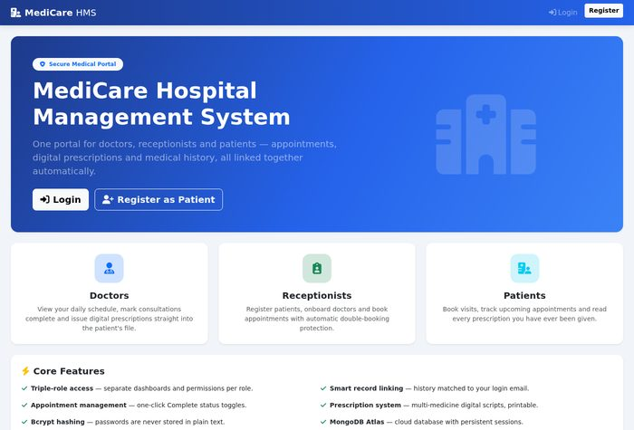

### Doctor Dashboard
Today's schedule with live stat cards, one-click **Complete** toggle (✓) and prescribe (℞).
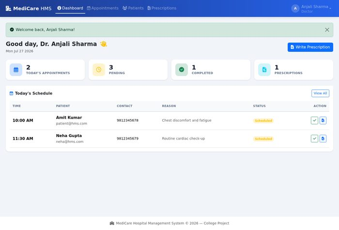

### Writing a Prescription
Dynamic medicine rows — add unlimited drugs with dosage, frequency and duration.
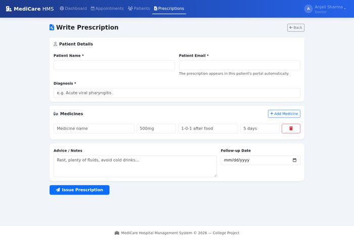

### Printable Prescription Sheet
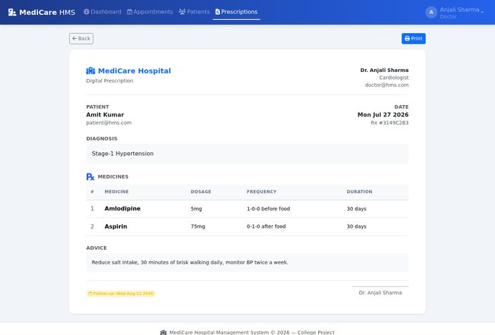

### Reception Dashboard
Hospital-wide stats and recent bookings across all doctors.
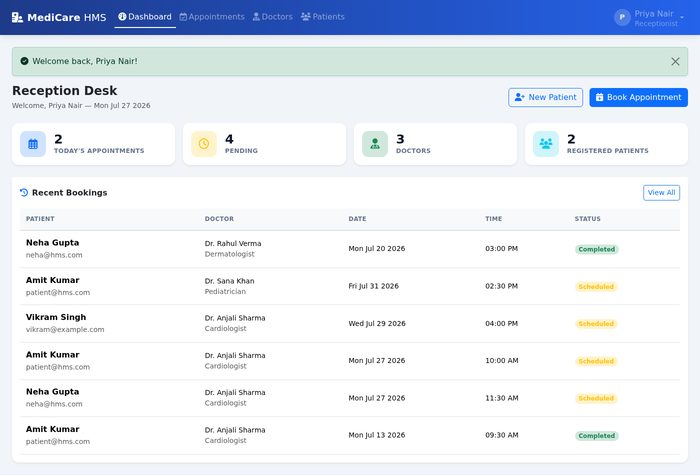

### Patient Dashboard
Next appointment plus recent activity — all matched by login email.
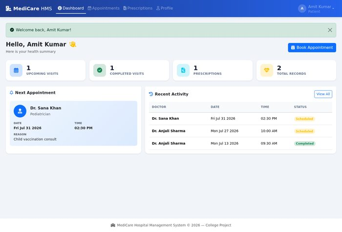

<details>
<summary><b>More screens</b> (click to expand)</summary>

#### Login
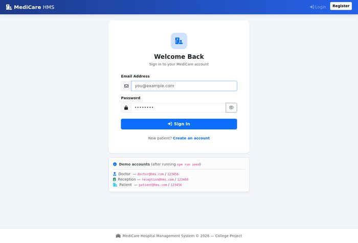

#### Doctor · Appointments
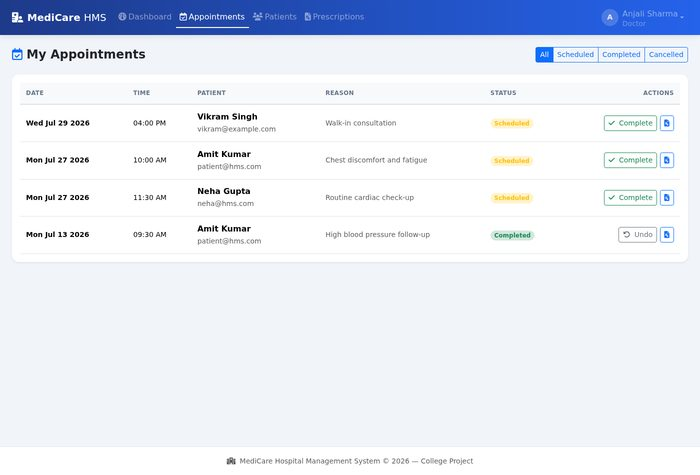

#### Doctor · Prescriptions Issued
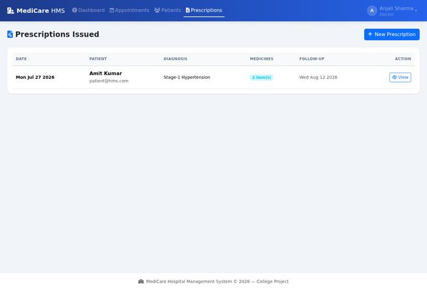

#### Reception · All Appointments
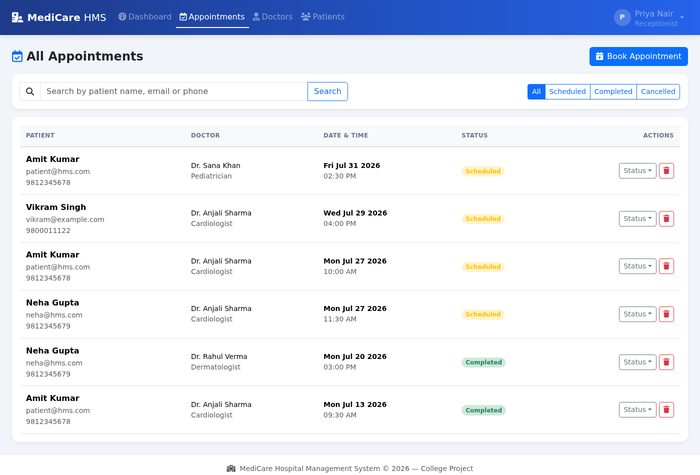

#### Reception · Doctors
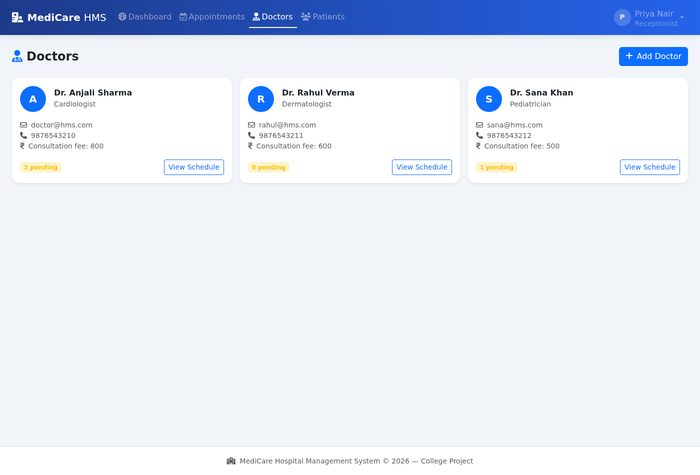

#### Reception · Book Appointment
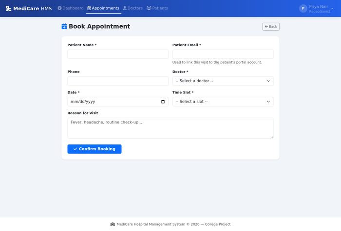

#### Patient · Prescriptions
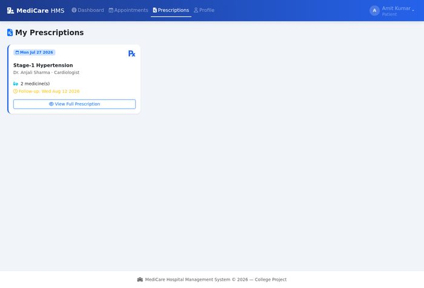

#### Patient · Appointments
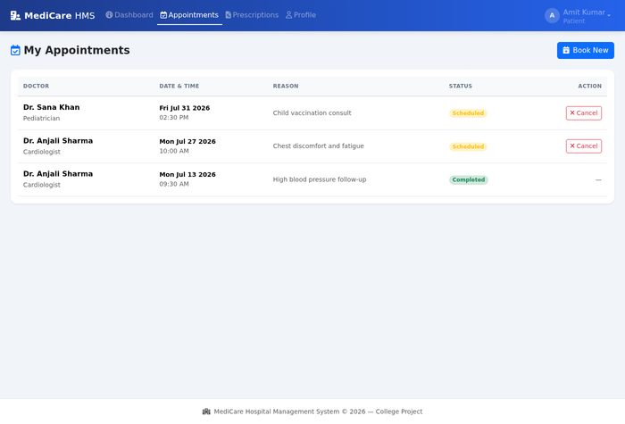

</details>

---

## 📝 License

ISC — built as a college project.
